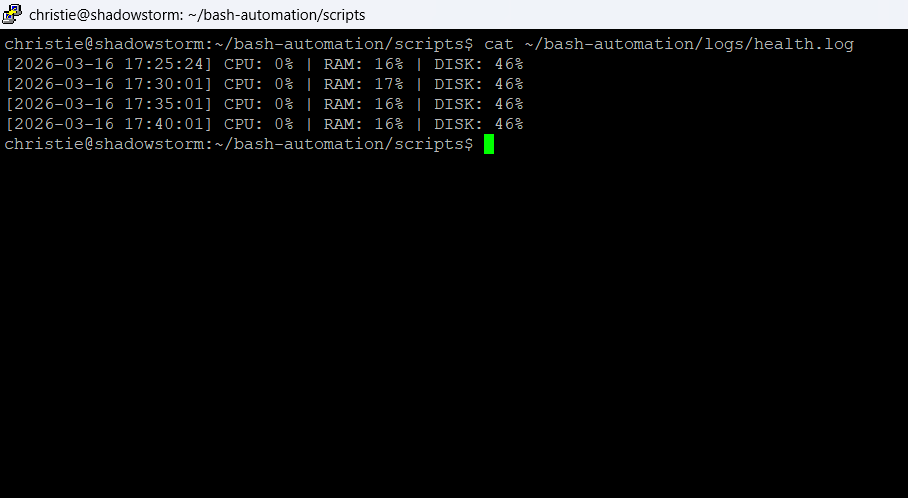

# bash-automation
# Bash Automation — System Health Monitor

A Bash script that monitors CPU, RAM, and disk usage on a Linux server,
logs metrics every 5 minutes via cron, and alerts when thresholds are breached.

## Stack
- Bash
- Cron
- Ubuntu Server 22.04 (running on Proxmox VM)

## How It Works
- Collects system metrics using top, free, and df
- Appends timestamped entries to a log file
- Fires threshold alerts inline to the same log

## Usage
```bash
chmod +x scripts/health_monitor.sh
./scripts/health_monitor.sh
```

## Screenshot


## Troubleshooting

### Wake on LAN not working after shutdown (Proxmox)
WoL setting resets after full shutdown on some network cards. Fix by creating a systemd service that re-enables it on every boot:

1. Create the service file:
```bash
nano /etc/systemd/system/wol.service
```

2. Enable and start it:
```bash
systemctl enable wol.service
systemctl start wol.service
```
This ensures WoL persists across shutdowns.
